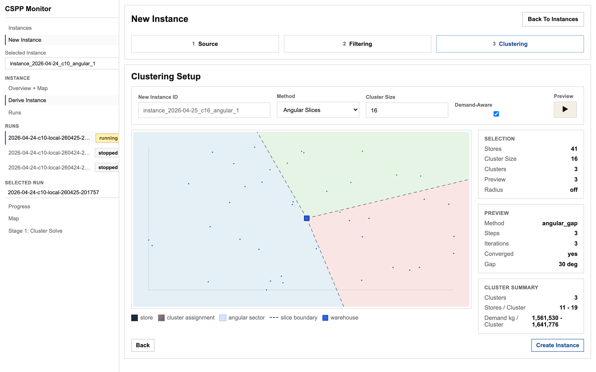
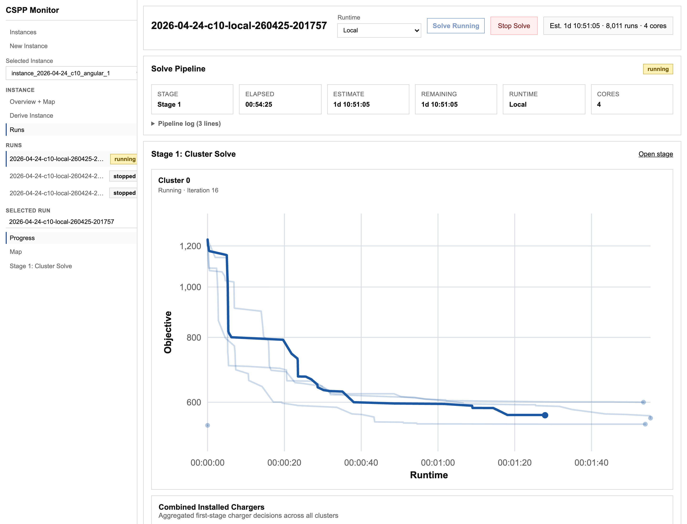

# CSPP

This repository contains the public code for a three-stage charging station planning pipeline and its web app.

Thesis PDF: [`thesis.pdf`](thesis.pdf)

Pipeline stages:

1. **Cluster solve**: solve first-stage charger decisions on store clusters.
2. **Scenario evaluation**: evaluate the combined first-stage solution on demand scenarios.
3. **Cluster reoptimization**: iteratively improve cluster-level charger decisions.

The repository intentionally excludes private raw delivery data, thesis sources, full-instance evaluation experiments, and alternative reoptimization method variants.

## Requirements

- Python 3.11 or newer
- Gurobi with a valid local license
- Node.js 20 or newer
- pnpm 9 or newer

Set `GRB_LICENSE_FILE` if Gurobi does not find your license automatically:

```bash
export GRB_LICENSE_FILE=/path/to/gurobi.lic
```

Install Python dependencies:

```bash
python3 -m venv .venv
source init_env.sh
pip install -r requirements.txt
```

Install web-app dependencies:

```bash
cd web-app
pnpm install
```

## Instance Data

The supported public input format is a single JSON instance payload. See:

- [`docs/instance-format.md`](docs/instance-format.md)
- [`schemas/instance-payload.schema.json`](schemas/instance-payload.schema.json)
- [`sample-data/demo/instance_payload.json`](sample-data/demo/instance_payload.json)
- [`thesis.pdf`](thesis.pdf)

Import the bundled sample:

```bash
source init_env.sh
python3 src/run.py import-instance sample-data/demo/instance_payload.json --run-name sample
```

## Run From CLI

List available public stages:

```bash
source init_env.sh
python3 src/run.py list
```

Run the full pipeline on an imported instance:

```bash
python3 src/run.py run all full --run-name sample
```

Or import and solve in one command:

```bash
python3 src/run.py run all full \
  --instance-payload sample-data/demo/instance_payload.json \
  --run-name sample
```

Useful flags:

- `--clustering-method {geographic,angular_slices,angular_slices_store_count,tour_containment}`
- `--vehicle-type {mercedes,volvo}`
- `--scenarios-to-use <n>`
- `--num-customers <n>` for small smoke runs
- `--second-stage-eval-timelimit <seconds>`
- `--second-stage-eval-mipgap <gap>`
- `--reopt-eval-mipgap <gap>`
- `--debug`

Outputs are written to `exports/runs/<run-name>/`.

## Run The Web App

The web app uses a FastAPI backend plus a SvelteKit frontend.

Start the backend:

```bash
source init_env.sh
cd src
uvicorn webserver:app --reload
```

Start the frontend in another terminal:

```bash
cd web-app
pnpm dev
```

Open `http://localhost:5173`. The frontend talks to the backend at `http://127.0.0.1:8000` by default. Override it with `PUBLIC_API_BASE_URL` if needed.

## Web App Runtime Delegation

The web app can run several experiments on different compute targets. Configure those targets in `configs/cspp_runtimes.json`.

- `local` runtimes execute from this checkout and write results under `var/webserver/exports`.
- `ssh` runtimes sync a prepared run to a remote project folder, start the pipeline there, poll status, and sync finished artifacts back.
- Each runtime has its own queue in `var/webserver/state/runtime_queues`, so one run can be active locally while another run is active on a VM.
- Start the backend with `source init_env.sh && cd src && uvicorn webserver:app --reload`; the in-process poller advances all runtime queues.
- Store SSH passwords or key paths in `.env` and reference them from `configs/cspp_runtimes.json` with `password_env` or `ssh_key_path_env`.
- Use the web UI runtime selector when creating a run, or call `POST /api/runs` with `runtime_id=<id>`.

An SSH runtime entry has this shape:

```json
{
  "id": "vm01",
  "label": "VM 01",
  "kind": "ssh",
  "project_root": ".",
  "export_root": "var/webserver/exports",
  "activation_command": "source init_env.sh",
  "prepare_commands": [
    "if [ ! -f .venv/bin/activate ]; then ~/anaconda3/bin/python -m venv --system-site-packages .venv; fi"
  ],
  "poll_interval_sec": 60,
  "source_sync_path": "src/",
  "host": "10.0.0.10",
  "user": "planner",
  "password_env": "CSPP_RUNTIME_VM01_PASSWORD",
  "remote_project_root": "~/max",
  "remote_export_root": "~/max/exports",
  "tags": ["vm"]
}
```

## Screenshots

Create a new instance and inspect the generated clustering before running the solver:



Track a running solve with stage progress, runtime estimates, and live optimization charts:



## Repository Layout

- `src/run.py`: public CLI entrypoint.
- `src/instance_payload.py`: instance-payload validation/import.
- `src/cspp/`: three-stage CSPP solver implementation.
- `src/clustering/`: public clustering methods.
- `src/webserver.py` and `src/webserver_backend/`: FastAPI backend.
- `web-app/`: SvelteKit frontend.
- `sample-data/`: demo sample instance.
- `docs/` and `schemas/`: input format documentation.

## Notes

The demo data is generated and intended for smoke tests and UI exploration. Full optimization runs require a working Gurobi installation and can take substantial time depending on instance size, scenario count, and hardware.
